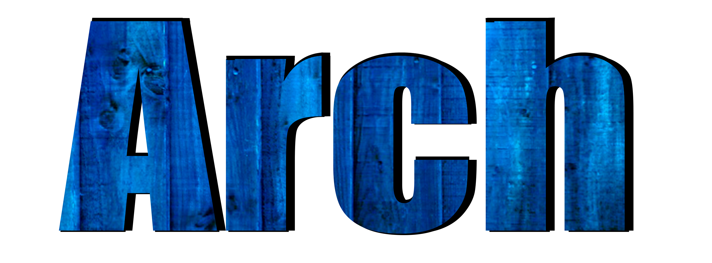

Arch is a small and lightweight library that helps to architecture Android Applications, it is based on several concepts of the functional paradigm and  Spotify's Mobius library but instead of using RxJava, it uses **Coroutines, SharedFlow and StateFlow**

This library is built upon the Android's ViewModel class and takes full advantage of it


## Download
```groovy
implementation 'com.fededri.arch:arch:1.0.0-alpha02'
```

## ArchViewModel
It is an abstract class extending from *ViewModel* and contains the main logic of this library,

## State
Handling state properly in every application is critical, with **Arch** you must define a custom State data class for each of your ViewModels, this state will be **inmmutable**

## RenderState
Optionally you can make a distinction between domain-state from render-state, so your views only has access to the data and objects they need to render the screen, in order to do that you have to pass into ArchViewModel's constructor a `StateMapper`

## Actions
With **Arch** the only way of changing anything in the app is by dispatching an **Action**, usually actions will be dispatched by user interactions, but not always.

## Updater
Updater is an interface with just one **pure function**, it receives an action, creates a new state from the previous one and returns a `Next` object. 
`Next` is a sealed class with types:
- `Next.State`
- `Next.StateWithSideEffects`
- `Next.StateWithSideEffectsAndEvents`
- `Next.StateWithEvents`

Depending on what type of `Next` object the ***Updater** returns in addition to changing the state, you can dispatch **SideEffects** and **Events** 

## SideEffects
They are usually blocking or long running operations like database transactions or network requests. When a SideEffect is dispatched, a new coroutine is created in order to execute it. By default the coroutine will be cancelled if the ViewModel is cleared, but you can pass in a custom `CoroutineScope` if you want to keep alive the coroutine even after the ViewModel is cleared, my recommendation -if that is the case - is to create a new `CoroutineScope` inside your `Application` class and pass it to the SideEffect's constructor

 
## Events
Usually they represent something that you want to notify to your view layer like popups, animations and transitions. If you have a single-activity architecture with multiple fragments, you can observe the same events from several fragments.

In your ViewModel's constructor, you can pass into the parameters an ``EventsConfiguration``, it is not mandatory but passing this parameter allows you to configure yours events.
- `Replays`: the number of events replayed to new subscribers, default is zero
- `ExtraBufferCapacity`: the number of values buffered in addition to `replay`, events under the hood are backed by a `SharedFlow` so if you emit an event and there is no space remaining in your buffer then the collector will be suspended
- `OnBufferOverflow` you can configure what action to take in case of buffer overflow, the default behavior is suspending

## Basic Usage
[Here](app/src/main/java/com/fedetto/example/) is an example of a basic usage of the library, this example is a counter with two buttons: up and down. When the counter reaches a multiple of ten, a ´SideEffect´ is dispatched that simulates an Input/Output operation and resets the counter.

#### What we should do first is define our `Actions` , `State`, and `SideEffects`

```kotlin
data class State(val counter: Int = 0)

sealed class Action {
    object Up : Action()
    object Down : Action()
    object Reset : Action()
}

sealed class Event {
    data class LogSomething(val text: String) : Event()
}

sealed class SideEffect(
    //Use IO dispatcher to run side effects
    override val dispatcher: CoroutineDispatcher = Dispatchers.IO,
    //use viewModelScope
    override val coroutineScope: CoroutineScope? = null
) : SideEffectInterface {
    //Set counter to zero
    object ResetEffect : SideEffect()
}
```

#### Now we need our `Processor` and `Updater`
```kotlin
class CounterProcessor : Processor<SideEffect, Action> {

    override suspend fun dispatchSideEffect(effect: SideEffect): Action {
        delay(3000)
        return Action.Reset
    }
}

class CounterUpdater : Updater<Action, State, SideEffect, Event> {

    override fun onNewAction(action: Action, currentState: State): Next<State, SideEffect, Event> {
        return when (action) {
            Action.Up -> changeCounter(currentState, true)
            Action.Down -> changeCounter(currentState, false)
            Action.Reset -> Next.State(currentState.copy(counter = 0))
        }
    }

    private fun changeCounter(
        currentState: State,
        isIncrement: Boolean
    ): Next<State, SideEffect, Event> {
        val next = when (isIncrement) {
            true -> currentState.counter + 1
            else -> currentState.counter - 1
        }

        return if ((next % 10) == 0) {
            Next.StateWithSideEffectsAndEvents(
                currentState.copy(counter = next),
                setOf(SideEffect.ResetEffect),
                setOf(Event.LogSomething("Multiple of 10"))
            )
        } else {
            Next.State(currentState.copy(counter = next))
        }
    }
}
```


#### Finally we just need to create our ViewModel, dispatch actions and observe the state from our activity or fragment


```kotlin
class ViewModel(
    updater: Updater<Action, State, SideEffect, Event>,
    processor: Processor<SideEffect, Action>
) : ArchViewModel<Action, State, SideEffect, Event, Nothing>(
    updater,
    State(),
    //Here we dispatch an initial SideEffect
    setOf(SideEffect.ResetEffect),
    processor
)


class MainActivity : AppCompatActivity() {

    lateinit var viewModel: ViewModel
    private val textView by lazy { findViewById<TextView>(R.id.textView) }

    override fun onCreate(savedInstanceState: Bundle?) {
        super.onCreate(savedInstanceState)
        setContentView(R.layout.activity_main)

        viewModel = ViewModel(Updater(), CounterProcessor())
        lifecycleScope.launchWhenResumed {
            viewModel.observeState().collect {
                renderState(it)
            }
        }

        findViewById<Button>(R.id.up).setOnClickListener {
            viewModel.action(Action.Up)
        }

        findViewById<Button>(R.id.down).setOnClickListener {
            viewModel.action(Action.Down)
        }
    }

    private fun renderState(state: State) {
        textView.text = state.counter.toString()
    }
}
        
        
```

#### Another example
I have migrated one of my demo apps to Arch, [This one](https://github.com/fededri/Reddit_Client/tree/coroutines_version) is a bit more complex than the previous example and fetchs real data from Reddit's API and makes use of `RenderState`, `Events` and error handling

## Error Handling
SideEffects execution is accomplished by using coroutines, so the error handling is very similar, if one effect's coroutine throws an exception and you don't catch it inside your code the app will throw the exception.

In that case, if  you want to avoid a crash, you can catch all coroutine exceptions defining a custom `CoroutineExceptionHandler` and pass it into ArchViewModel's constructor

```kotlin
class EffectsExceptionHandler: AbstractCoroutineContextElement(CoroutineExceptionHandler),
    CoroutineExceptionHandler {
    override fun handleException(context: CoroutineContext, exception: Throwable) {
        //handle your exception
    }
}
```

If you are using the default `CoroutineScope` (viewModelScope), children coroutines fail independently of each other because this scope uses a `SupervisorJob`, but if you set a custom scope you must take care of this case

## Running SideEffects that lives outside of your ViewModel lifecycle
All SideEffects are cancelled when your ViewModel is cleared. If you want to avoid this, specify a custom scope so you can dispatch long-running effects independent of your ViewModel lifecycle. You can specify in which thread and scope you want to run each of your SideEffects, I recommend creating a new scope in your `Application` class, just take in mind that you have to take care of cancellation and exceptions.


```kotlin
sealed class SideEffect(
    //Use CPU dispatcher to run side effects
    override val dispatcher: CoroutineDispatcher = Dispatchers.IO,
    //use viewModelScope
    override val coroutineScope: CoroutineScope? = null
) : SideEffectInterface {
    
    //This effect will run in a custom scope and will use the Default dispatcher
    object ResetEffect : SideEffect(Dispatchers.Default, CustomCoroutineScope())
}
```


